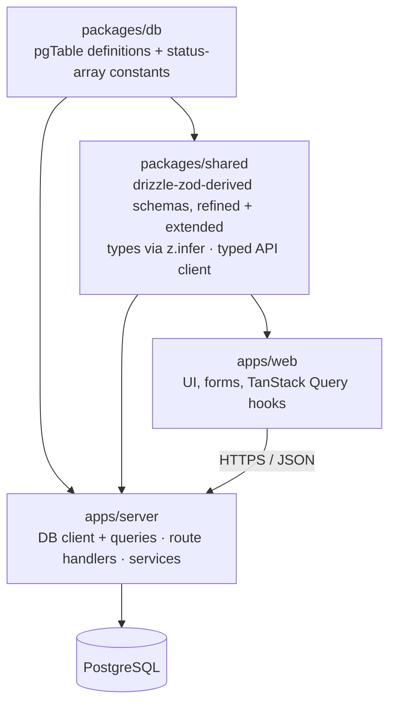
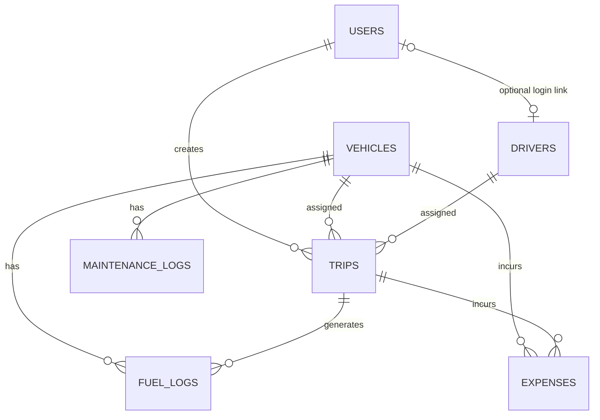
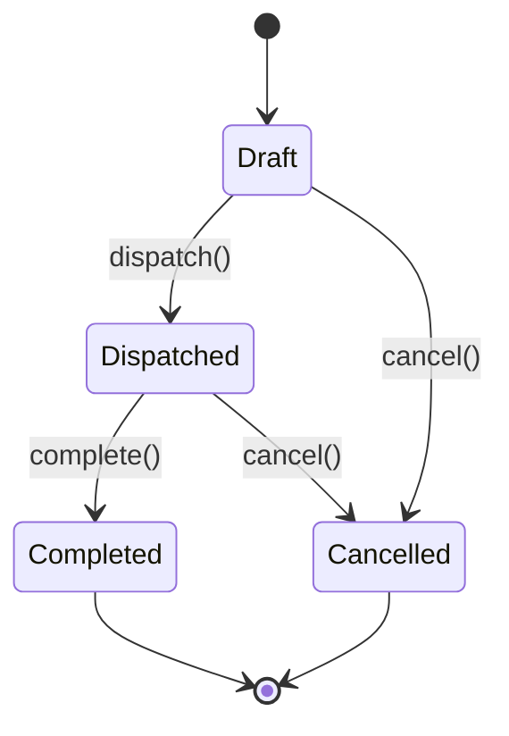
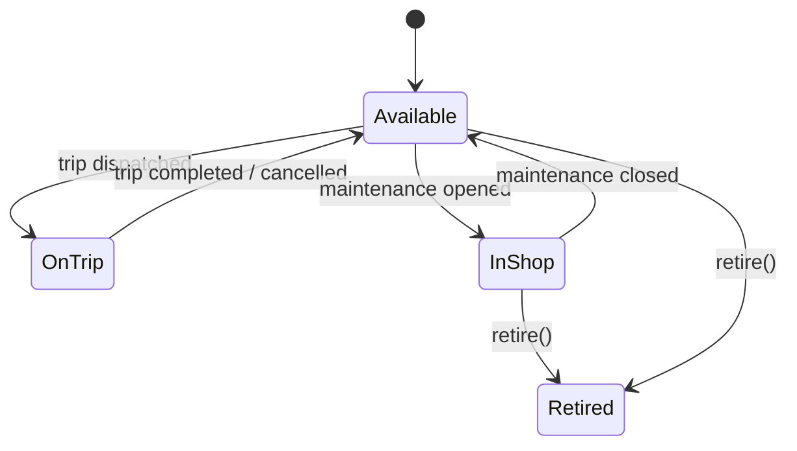
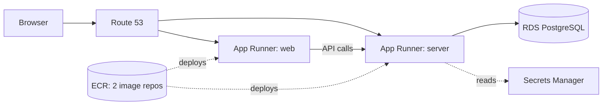

# TransitOps — System Design Document

**Status:** Draft v0.1 · **Date:** 12 Jul 2026 · **Scope:** Hackathon build (8h) with production-grade bones

This is written to be executed against directly — folder names, file names, and code in here are meant to be typed, not reinterpreted. Section 2 and 3 contain decisions I made on your behalf where the brief was silent or your auth template didn't match the target stack; skim those first since they change what you type in hour one.

## Table of Contents
1. [Purpose & Principles](#1-purpose--principles)
2. [What I Found In Your Auth Template](#2-what-i-found-in-your-auth-template)
3. [Assumptions & Gaps I Filled](#3-assumptions--gaps-i-filled)
4. [Tech Stack Decisions](#4-tech-stack-decisions)
5. [Monorepo Structure](#5-monorepo-structure)
6. [Domain Model](#6-domain-model)
7. [State Machines & Business Rule Enforcement](#7-state-machines--business-rule-enforcement)
8. [Auth & RBAC](#8-auth--rbac)
9. [Validation Pipeline](#9-validation-pipeline)
10. [API Design](#10-api-design)
11. [API Documentation (OpenAPI + Scalar)](#11-api-documentation-openapi--scalar)
12. [Logging](#12-logging)
13. [Frontend Architecture](#13-frontend-architecture)
14. [Testing Strategy](#14-testing-strategy)
15. [Security](#15-security)
16. [Performance](#16-performance)
17. [Deployment](#17-deployment)
18. [8-Hour Execution Roadmap](#18-8-hour-execution-roadmap)

---

## 1. Purpose & Principles

TransitOps digitizes vehicle, driver, dispatch, maintenance, and expense management for a logistics fleet, replacing spreadsheets with one system of record that enforces the business rules spreadsheets can't.

Five principles govern every decision below:

- **One source of truth.** Every fact is defined in exactly one file and flows outward — DB shape, validation, types, and docs are all derived, never hand-duplicated.
- **Modularity without ceremony.** Clear layer boundaries (route → service → data), but no abstraction that doesn't pay for itself in an 8-entity, single-team build.
- **Server owns the logic.** The web app renders and collects input; every business rule, status transition, and calculation happens server-side and is re-validated there even if the UI already checked it.
- **Fail loud, fail typed.** Every error path returns a structured, predictable shape — never a raw 500 or a silent `undefined`.
- **Simple beats clever.** If a pattern needs a paragraph to justify, it's called out explicitly below so you know it's a deliberate trade, not a default.

**On the 8-hour constraint:** the source brief is an 8-hour hackathon; this document specs a genuinely production-shaped system (Docker, AWS, OpenAPI, structured logging, real test coverage). Those aren't in tension if you sequence correctly — Section 18 gives you the cut line. Build the domain + business rules first; docs, tests-for-everything, and AWS are what you trade away first if the clock wins.

---

## 2. What I Found In Your Auth Template

I cloned `sinanptm/clean-auth-template` rather than guess at it. Headline: **`web/` is a near-perfect match for your target stack and should be reused directly. `server/` is not, and shouldn't be copied wholesale.**

| | Template has | You asked for |
|---|---|---|
| Backend framework | Express 5 (standalone Node server) | Next.js (Route Handlers) |
| Database | MongoDB + Mongoose | PostgreSQL + Drizzle |
| Validation | Joi | Zod |
| Architecture | Full Clean Architecture: DI container (`inversify`), `use_case` classes, repository interfaces, 4-layer folder split | "Highly modular... logical and simple" |
| RBAC | Binary `Admin` / `User` enum, hardcoded per-middleware | 4 roles: Fleet Manager, Driver, Safety Officer, Financial Analyst |

**`web/` (keep as-is, it's already your stack):** Next.js 15.5.4, React 19, **Tailwind CSS v4** (CSS-based config via `@tailwindcss/postcss`, no `tailwind.config.js`), shadcn/ui (Radix + `class-variance-authority` + `tailwind-merge`), **TanStack Query v5** (already wired — this matters for §13), **Zod v4**, `react-hook-form` + `@hookform/resolvers`, `zustand`, `axios` + `axios-auth-refresh`, `next-themes` (dark mode is a bonus-feature freebie), `sonner` for toasts. This becomes `apps/web` with minimal changes.

**`server/` (port the logic, not the code):** the auth *pattern* is genuinely good and worth carrying over faithfully:

```ts
// The dual-token JWT strategy from TokenService.ts — port this exactly, it's solid:
createAccessToken({ id, email, role }) → 5 min expiry, ACCESS_TOKEN_SECRET
createRefreshToken({ id, email })      → 7 day expiry, REFRESH_TOKEN_SECRET (deliberately excludes role — forces a fresh role lookup on refresh instead of trusting a stale claim)
// Distinct 498 "token expired" status (vs generic 401) lets axios-auth-refresh's
// interceptor tell "expired, try silent refresh" apart from "actually invalid."
```

What does **not** port over: `inversify` DI bindings, the `use_case`/repository-interface layers, and Mongoose models. For 8 entities and one dev, that ceremony costs more hours than it saves — Drizzle's query builder is already a clean, typed abstraction, so a repository layer on top of it is redundant. Section 8 gives you the re-implementation against Drizzle, in plain modules.

One free simplification: Next.js Route Handlers get cookie access natively via `cookies()` from `next/headers` — you don't need the `cookie-parser` package the template pulls in for Express. `helmet`, `bcryptjs`, `rate-limiter-flexible`, and `winston`/`winston-daily-rotate-file` are all still worth keeping; they're framework-agnostic.

---

## 3. Assumptions & Gaps I Filled

The brief has a few silent gaps that would block implementation if left unresolved. I made a call on each — flag any you want to override before hour one:

1. **Revenue is never defined, but the ROI formula needs it.** `ROI = (Revenue − (Maintenance + Fuel)) / Acquisition Cost` has no data source for Revenue anywhere in the functional requirements. **Added `trips.revenue`** (nullable numeric, entered on trip completion). ROI aggregates `SUM(trips.revenue)` per vehicle.
2. **"Driver" is overloaded.** §2 (Target Users) describes Driver as a *login role* that "creates trips, assigns vehicles and drivers." §3.4 describes Driver as a *roster resource* (license, safety score, compliance status). These aren't always the same person — a Fleet Manager can dispatch trips for drivers who never log in. **Split into two tables:** `users` (login/RBAC) and `drivers` (roster/compliance), linked by a nullable `userId` FK — a driver profile *can* have a login later without requiring one now.
3. **Dashboard needs a "region" filter (§3.2) but no entity defines one.** **Added `vehicles.region`** (free text) as the filter source; trips inherit region context from their vehicle.
4. **Cost accounting overlaps.** §3.7 says "Operational Cost = Fuel + Maintenance," but also asks to record "expenses such as tolls **or maintenance**" — implying maintenance cost might get double-entered in two places. **Resolution:** `maintenance_logs.cost` and `fuel_logs.cost` are the only sources for those categories; `expenses` is strictly *other* costs (tolls, fines, parking). I'm computing **Total Operational Cost = Fuel + Maintenance + Expenses** (a small, deliberate extension past the literal spec — otherwise the Expenses entity feeds no metric at all). Trivial to revert to the literal two-term formula if a grader wants exact spec compliance.
5. **Vehicle Type and License Category have no enumerated values.** Vehicle Type → enum (`truck`, `van`, `pickup`, `trailer`) since it drives filtering. License Category → left as free text, since license classes are jurisdiction-specific and a wrong enum is worse than none.
6. **Safety Score has no computation rule.** No incident/violation entity exists to derive it from, so it's a manually-editable field (Safety Officer / Fleet Manager), not auto-computed.
7. **Draft trips don't lock resources.** Re-reading the rules closely: "a vehicle/driver already marked On Trip cannot be assigned" — the constraint is against the *status*, which only flips at dispatch, not at draft creation. So two drafts *can* reference the same vehicle; the conflict surfaces at dispatch time. This is handled correctly (not a bug) — see §7 for how.
8. **Real-time / hooks / SSE / WebSocket — you asked directly, here's the call:** none of the three needed. Nothing in this spec requires push updates — no chat, no live map, no cross-user notification requirement. The one place concurrency *seems* to need real-time (two dispatchers racing for the same vehicle) is actually a data-integrity problem, solved correctly at the DB-transaction level (§7), not a UI-latency problem. **Skip SSE/WebSocket entirely.** "Hooks" — yes, use them, but as in: TanStack Query custom hooks (`useVehicles()`, `useTrips()`) for data fetching, which is just normal React architecture and is already wired into your template. Add focus-refetch (Query's default) + mutation-based cache invalidation, and a 30–60s poll only on the dashboard KPI view for a "live-ish" feel. That's the whole real-time story, and it costs you zero extra infrastructure.

---

## 4. Tech Stack Decisions

| Layer | Choice | Rationale |
|---|---|---|
| Monorepo | pnpm v10 workspaces, no Turborepo | You didn't ask for Turborepo; pnpm's `--filter` + `catalog:` covers everything needed at this scale |
| Frontend | Next.js 15.5.4 (App Router), Tailwind v4, shadcn/ui | Reused verbatim from your template |
| Backend | Next.js 15.5.4, Route Handlers only (no pages) | Honors your literal stack table; kept as a **separate app**, not folded into `apps/web`, per your folder ask |
| DB schema truth | Drizzle table definitions in `packages/db` | Framework-agnostic package; both `apps/server` and schema-derivation logic can depend on it without depending on the Next server |
| Validation truth | `drizzle-zod` deriving base Zod schemas from `packages/db`, refined in `packages/shared` | Column changes propagate automatically to validation and types — see §9 for why this beats hand-written parallel schemas |
| DB | PostgreSQL 16, Docker locally, RDS in AWS | Managed DB in the cloud, containerized for dev — standard split, not "self-host Postgres in prod" |
| API docs | `swagger-jsdoc` (as you specified) for path docs, but `components.schemas` generated from the same Zod schemas via `zod-to-json-schema` — not hand-typed twice | Preserves single-source-of-truth even though JSDoc-style docs are inherently comment-based |
| Real-time | **None.** TanStack Query invalidation + light polling | See assumption #8 above |
| Testing | Vitest, service tests direct; route-handler tests via `next-test-api-route-handler` (NTARH) | Supertest needs a raw `http.Server` — Next Route Handlers don't expose one. NTARH invokes handlers through Next's own resolver and gives a `fetch`-equivalent client, which is the practical, currently-maintained answer to "Supertest for Next.js App Router." Noted here explicitly since it's a literal substitution for something you asked for by name. |
| Deploy | Docker (multi-stage, Next `standalone` output) → AWS App Runner + RDS | App Runner over raw ECS+ALB+VPC: same container, a fraction of the AWS ceremony, still auto-scaling and HTTPS out of the box |

---

## 5. Monorepo Structure

```
transitops/
├── pnpm-workspace.yaml
├── package.json
├── docker-compose.yml              # local Postgres for dev
├── apps/
│   ├── server/                     # Next.js — API ONLY, no pages
│   │   ├── src/
│   │   │   ├── app/
│   │   │   │   ├── api/
│   │   │   │   │   ├── auth/{login,refresh,logout,me}/route.ts
│   │   │   │   │   ├── vehicles/route.ts            # GET, POST
│   │   │   │   │   ├── vehicles/[id]/route.ts        # GET, PATCH
│   │   │   │   │   ├── vehicles/[id]/retire/route.ts # POST (action)
│   │   │   │   │   ├── drivers/...
│   │   │   │   │   ├── trips/route.ts
│   │   │   │   │   ├── trips/[id]/{dispatch,complete,cancel}/route.ts
│   │   │   │   │   ├── maintenance/[id]/close/route.ts
│   │   │   │   │   ├── fuel-logs/route.ts
│   │   │   │   │   ├── expenses/route.ts
│   │   │   │   │   ├── dashboard/kpis/route.ts
│   │   │   │   │   ├── reports/{fuel-efficiency,fleet-utilization,operational-cost,vehicle-roi}/route.ts
│   │   │   │   │   └── openapi.json/route.ts
│   │   │   │   └── docs/route.ts    # Scalar UI mount
│   │   │   ├── modules/
│   │   │   │   ├── vehicles/{vehicle.service.ts, vehicle.repository.ts?}
│   │   │   │   ├── drivers/...
│   │   │   │   ├── trips/trip.service.ts   # the heart of the app — §7
│   │   │   │   ├── maintenance/...
│   │   │   │   ├── fuel-logs/...
│   │   │   │   ├── expenses/...
│   │   │   │   └── reports/report.service.ts
│   │   │   ├── lib/
│   │   │   │   ├── db.ts            # drizzle(pool) client, imports packages/db schema
│   │   │   │   ├── auth.ts          # JWT sign/verify, ported from template
│   │   │   │   ├── rbac.ts          # requireRole() middleware
│   │   │   │   ├── errors.ts        # AppError + centralized error → response mapping
│   │   │   │   ├── logger.ts        # Winston config
│   │   │   │   └── api-handler.ts   # withApiHandler() wrapper: auth extraction + try/catch
│   │   │   └── db/migrations/       # drizzle-kit output
│   │   ├── drizzle.config.ts
│   │   ├── next.config.ts           # output: 'standalone'
│   │   ├── Dockerfile
│   │   └── package.json
│   └── web/                         # Next.js — UI only (from template)
│       ├── src/app/{login,dashboard,vehicles,drivers,trips,maintenance,reports}/...
│       ├── src/hooks/                # useVehicles(), useTrips(), etc. — TanStack Query
│       ├── src/components/
│       ├── Dockerfile
│       └── package.json
├── packages/
│   ├── db/                          # Drizzle schema ONLY — no client, no env access
│   │   ├── src/schema.ts
│   │   ├── src/constants.ts         # the root arrays: VEHICLE_STATUS, USER_ROLES, etc.
│   │   └── package.json
│   └── shared/                      # zod schemas (derived from packages/db), types, API client
│       ├── src/schemas/{vehicle,driver,trip,maintenance,fuel-log,expense,auth}.schema.ts
│       ├── src/api-client.ts        # typed fetch wrapper, used by apps/web only
│       ├── src/errors.ts            # shared error-shape type
│       └── package.json
└── infra/
    └── aws/                         # apprunner.yaml / IaC, see §17
```

**Dependency direction** — this is what makes "one source of truth" actually hold, not just a slogan:



`packages/db` never imports from `apps/server` — it has no env-var access, no connection logic, just table shapes. `apps/server` is the only package that ever opens a DB connection. `apps/web` never imports `packages/db` directly; it only knows about `packages/shared`'s inferred types and API client. This means a Postgres column can never silently drift out of sync with what the frontend thinks a `Vehicle` looks like — there is exactly one place that fact is written down.

**`pnpm-workspace.yaml`:**
```yaml
packages:
  - "apps/*"
  - "packages/*"
catalog:
  typescript: ^5.9.2
  zod: ^4.1.11
  next: 15.5.4
  react: ^19.1.1
  react-dom: ^19.1.1
```
Every `package.json` in the workspace references shared versions via `"zod": "catalog:"` instead of repeating the range — one line to bump, no drift between `apps/server` and `apps/web`.

---

## 6. Domain Model



**`packages/db/src/constants.ts`** — the actual root of every enum in the system:
```ts
export const USER_ROLES = ["fleet_manager", "driver", "safety_officer", "financial_analyst"] as const;
export const VEHICLE_STATUS = ["available", "on_trip", "in_shop", "retired"] as const;
export const VEHICLE_TYPES = ["truck", "van", "pickup", "trailer"] as const;
export const DRIVER_STATUS = ["available", "on_trip", "off_duty", "suspended"] as const;
export const TRIP_STATUS = ["draft", "dispatched", "completed", "cancelled"] as const;
export const MAINTENANCE_STATUS = ["active", "closed"] as const;
export const EXPENSE_CATEGORY = ["toll", "fine", "parking", "other"] as const;
```

**`packages/db/src/schema.ts`:**
```ts
import { pgTable, pgEnum, uuid, varchar, text, numeric, integer, date, timestamp, index } from "drizzle-orm/pg-core";
import * as C from "./constants";

export const userRoleEnum = pgEnum("user_role", C.USER_ROLES);
export const vehicleStatusEnum = pgEnum("vehicle_status", C.VEHICLE_STATUS);
export const vehicleTypeEnum = pgEnum("vehicle_type", C.VEHICLE_TYPES);
export const driverStatusEnum = pgEnum("driver_status", C.DRIVER_STATUS);
export const tripStatusEnum = pgEnum("trip_status", C.TRIP_STATUS);
export const maintenanceStatusEnum = pgEnum("maintenance_status", C.MAINTENANCE_STATUS);
export const expenseCategoryEnum = pgEnum("expense_category", C.EXPENSE_CATEGORY);

export const users = pgTable("users", {
  id: uuid("id").primaryKey().defaultRandom(),
  email: varchar("email", { length: 255 }).notNull().unique(),
  passwordHash: text("password_hash").notNull(),
  name: varchar("name", { length: 120 }).notNull(),
  role: userRoleEnum("role").notNull(),
  createdAt: timestamp("created_at", { withTimezone: true }).notNull().defaultNow(),
  updatedAt: timestamp("updated_at", { withTimezone: true }).notNull().defaultNow(),
});

export const vehicles = pgTable("vehicles", {
  id: uuid("id").primaryKey().defaultRandom(),
  registrationNumber: varchar("registration_number", { length: 32 }).notNull().unique(),
  name: varchar("name", { length: 120 }).notNull(),
  type: vehicleTypeEnum("type").notNull(),
  maxLoadCapacityKg: numeric("max_load_capacity_kg", { precision: 10, scale: 2 }).notNull(),
  odometerKm: numeric("odometer_km", { precision: 12, scale: 2 }).notNull().default("0"),
  acquisitionCost: numeric("acquisition_cost", { precision: 12, scale: 2 }).notNull(),
  region: varchar("region", { length: 80 }),
  status: vehicleStatusEnum("status").notNull().default("available"),
  createdAt: timestamp("created_at", { withTimezone: true }).notNull().defaultNow(),
  updatedAt: timestamp("updated_at", { withTimezone: true }).notNull().defaultNow(),
}, (t) => [
  index("vehicles_status_idx").on(t.status),
  index("vehicles_region_idx").on(t.region),
]);

export const drivers = pgTable("drivers", {
  id: uuid("id").primaryKey().defaultRandom(),
  userId: uuid("user_id").references(() => users.id, { onDelete: "set null" }),
  name: varchar("name", { length: 120 }).notNull(),
  licenseNumber: varchar("license_number", { length: 64 }).notNull().unique(),
  licenseCategory: varchar("license_category", { length: 32 }).notNull(),
  licenseExpiryDate: date("license_expiry_date").notNull(),
  contactNumber: varchar("contact_number", { length: 20 }).notNull(),
  safetyScore: integer("safety_score").notNull().default(100),
  status: driverStatusEnum("status").notNull().default("available"),
  createdAt: timestamp("created_at", { withTimezone: true }).notNull().defaultNow(),
  updatedAt: timestamp("updated_at", { withTimezone: true }).notNull().defaultNow(),
}, (t) => [index("drivers_status_idx").on(t.status)]);

export const trips = pgTable("trips", {
  id: uuid("id").primaryKey().defaultRandom(),
  tripCode: varchar("trip_code", { length: 20 }).notNull().unique(),
  source: varchar("source", { length: 160 }).notNull(),
  destination: varchar("destination", { length: 160 }).notNull(),
  vehicleId: uuid("vehicle_id").notNull().references(() => vehicles.id),
  driverId: uuid("driver_id").notNull().references(() => drivers.id),
  cargoWeightKg: numeric("cargo_weight_kg", { precision: 10, scale: 2 }).notNull(),
  plannedDistanceKm: numeric("planned_distance_km", { precision: 10, scale: 2 }).notNull(),
  startOdometerKm: numeric("start_odometer_km", { precision: 12, scale: 2 }),
  endOdometerKm: numeric("end_odometer_km", { precision: 12, scale: 2 }),
  fuelConsumedLiters: numeric("fuel_consumed_liters", { precision: 10, scale: 2 }),
  revenue: numeric("revenue", { precision: 12, scale: 2 }),        // gap-fill, see §3.1
  status: tripStatusEnum("status").notNull().default("draft"),
  createdBy: uuid("created_by").notNull().references(() => users.id),
  dispatchedAt: timestamp("dispatched_at", { withTimezone: true }),
  completedAt: timestamp("completed_at", { withTimezone: true }),
  cancelledAt: timestamp("cancelled_at", { withTimezone: true }),
  createdAt: timestamp("created_at", { withTimezone: true }).notNull().defaultNow(),
  updatedAt: timestamp("updated_at", { withTimezone: true }).notNull().defaultNow(),
}, (t) => [
  index("trips_status_idx").on(t.status),
  index("trips_vehicle_idx").on(t.vehicleId),
  index("trips_driver_idx").on(t.driverId),
]);

export const maintenanceLogs = pgTable("maintenance_logs", {
  id: uuid("id").primaryKey().defaultRandom(),
  vehicleId: uuid("vehicle_id").notNull().references(() => vehicles.id),
  description: varchar("description", { length: 255 }).notNull(),
  cost: numeric("cost", { precision: 12, scale: 2 }).notNull().default("0"),
  status: maintenanceStatusEnum("status").notNull().default("active"),
  openedAt: timestamp("opened_at", { withTimezone: true }).notNull().defaultNow(),
  closedAt: timestamp("closed_at", { withTimezone: true }),
  createdBy: uuid("created_by").notNull().references(() => users.id),
}, (t) => [index("maintenance_vehicle_idx").on(t.vehicleId)]);

export const fuelLogs = pgTable("fuel_logs", {
  id: uuid("id").primaryKey().defaultRandom(),
  vehicleId: uuid("vehicle_id").notNull().references(() => vehicles.id),
  tripId: uuid("trip_id").references(() => trips.id),
  liters: numeric("liters", { precision: 10, scale: 2 }).notNull(),
  cost: numeric("cost", { precision: 12, scale: 2 }).notNull(),
  loggedAt: date("logged_at").notNull(),
  createdBy: uuid("created_by").notNull().references(() => users.id),
}, (t) => [index("fuel_logs_vehicle_idx").on(t.vehicleId)]);

export const expenses = pgTable("expenses", {
  id: uuid("id").primaryKey().defaultRandom(),
  vehicleId: uuid("vehicle_id").references(() => vehicles.id),
  tripId: uuid("trip_id").references(() => trips.id),
  category: expenseCategoryEnum("category").notNull(),
  amount: numeric("amount", { precision: 12, scale: 2 }).notNull(),
  incurredAt: date("incurred_at").notNull(),
  notes: varchar("notes", { length: 255 }),
  createdBy: uuid("created_by").notNull().references(() => users.id),
}, (t) => [index("expenses_vehicle_idx").on(t.vehicleId)]);
```

`drizzle.config.ts` (in `apps/server`, since that's the only place with `DATABASE_URL`):
```ts
import "dotenv/config";
import { defineConfig } from "drizzle-kit";

export default defineConfig({
  schema: "../../packages/db/src/schema.ts",
  out: "./src/db/migrations",
  dialect: "postgresql",
  dbCredentials: { url: process.env.DATABASE_URL! },
});
```
Workflow: `drizzle-kit generate` to create a migration file, `drizzle-kit migrate` to apply it. Use `drizzle-kit push` only for rapid local iteration before your first real migration — never against anything with data you care about.

---

## 7. State Machines & Business Rule Enforcement





| Spec rule | Where enforced |
|---|---|
| Registration number / license number unique | DB unique constraint (last line of defense) + Zod won't catch this — it's cross-row, so a friendly duplicate-key catch in the service layer maps the Postgres `23505` error to a clean 409 |
| Retired/In Shop never dispatched | Query filter (`WHERE status = 'available'`) on every vehicle-selection list, **and** re-checked atomically at dispatch (below) — never trust a UI-time snapshot |
| Expired license / suspended driver blocked | Computed at request time from `licenseExpiryDate` — **never a stored `isExpired` boolean**. A stored derived flag is exactly the kind of second source of truth this system is designed to avoid; it would drift the instant a license passes its date without anyone touching the row. |
| Vehicle/driver already On Trip blocked | Conditional `UPDATE ... WHERE status = 'available'` — see below |
| Cargo ≤ max load capacity | Zod can't do this (needs a DB lookup) — service-layer check after loading the vehicle row |
| Dispatch flips both to On Trip; Complete/Cancel restores both | Single DB transaction per action — partial application is not an acceptable state |
| Maintenance open flips vehicle to In Shop; close restores unless Retired | `UPDATE vehicles SET status='available' WHERE id=? AND status='in_shop'` — the `WHERE` clause *is* the "unless retired" rule; if it's been separately retired, this update simply matches zero rows |

**The concurrency-correct dispatch service** — this is the one function in the whole system where getting it wrong causes silent double-booking, so it's worth showing in full:

```ts
// apps/server/src/modules/trips/trip.service.ts
export async function dispatchTrip(tripId: string) {
  return db.transaction(async (tx) => {
    // 1. Atomically claim the TRIP itself — guards against double-dispatch of the same trip
    const [trip] = await tx.update(trips)
      .set({ status: "dispatched", dispatchedAt: new Date(), updatedAt: new Date() })
      .where(and(eq(trips.id, tripId), eq(trips.status, "draft")))
      .returning();

    if (!trip) {
      const existing = await tx.query.trips.findFirst({ where: eq(trips.id, tripId) });
      if (!existing) throw new AppError("NOT_FOUND", "Trip not found", 404);
      throw new AppError("BUSINESS_RULE_VIOLATION", `Trip is already ${existing.status}`, 409);
    }

    // 2. Compliance checks — fast, friendly error messages before touching shared resources
    const driver = await tx.query.drivers.findFirst({ where: eq(drivers.id, trip.driverId) });
    if (!driver) throw new AppError("NOT_FOUND", "Driver not found", 404);
    if (driver.status === "suspended")
      throw new AppError("BUSINESS_RULE_VIOLATION", "Driver is suspended", 409);
    if (driver.licenseExpiryDate < todayISODate())
      throw new AppError("BUSINESS_RULE_VIOLATION", "Driver license has expired", 409);

    // 3. Atomically CLAIM the vehicle — this is the real race guard. If another
    //    request dispatched it a millisecond ago, `status` is no longer 'available'
    //    and this UPDATE matches zero rows, regardless of what any UI had cached.
    const [claimedVehicle] = await tx.update(vehicles)
      .set({ status: "on_trip", updatedAt: new Date() })
      .where(and(eq(vehicles.id, trip.vehicleId), eq(vehicles.status, "available")))
      .returning();
    if (!claimedVehicle)
      throw new AppError("CONFLICT", "Vehicle is no longer available", 409); // tx rolls back — trip reverts to draft

    // 4. Same atomic claim for the driver
    const [claimedDriver] = await tx.update(drivers)
      .set({ status: "on_trip", updatedAt: new Date() })
      .where(and(eq(drivers.id, trip.driverId), eq(drivers.status, "available")))
      .returning();
    if (!claimedDriver)
      throw new AppError("CONFLICT", "Driver is no longer available", 409);

    return trip;
  });
}
```

Because `db.transaction()` rolls back on any thrown error, an uncaught failure at step 3 or 4 correctly reverts the trip to `draft` — no manual cleanup code needed. This is the pattern to replicate for `completeTrip`, `cancelTrip`, and `closeMaintenance`: **conditional `UPDATE...WHERE` as the concurrency guard, not a `SELECT` followed by a trusting `UPDATE`.**

---

## 8. Auth & RBAC

Faithful port of the template's dual-token strategy (§2), re-implemented as plain functions against Drizzle instead of an injected class against Mongoose:

```ts
// apps/server/src/lib/auth.ts
import { SignJWT, jwtVerify } from "jose"; // or `jsonwebtoken`, matching the template

const ACCESS_SECRET = new TextEncoder().encode(process.env.ACCESS_TOKEN_SECRET!);
const REFRESH_SECRET = new TextEncoder().encode(process.env.REFRESH_TOKEN_SECRET!);

export async function createAccessToken(payload: { id: string; email: string; role: UserRole }) {
  return new SignJWT(payload).setProtectedHeader({ alg: "HS256" }).setExpirationTime("5m").sign(ACCESS_SECRET);
}
export async function createRefreshToken(payload: { id: string; email: string }) {
  return new SignJWT(payload).setProtectedHeader({ alg: "HS256" }).setExpirationTime("7d").sign(REFRESH_SECRET);
}
// verifyAccessToken / verifyRefreshToken mirror the template: distinguish expired vs invalid,
// refresh token deliberately carries no `role` claim — re-fetch it from `users` on every refresh.
```

```ts
// apps/server/src/lib/rbac.ts
export function requireRole(user: AuthUser, allowed: UserRole[]) {
  if (!allowed.includes(user.role)) {
    throw new AppError("FORBIDDEN", `Requires one of: ${allowed.join(", ")}`, 403);
  }
}
```

**Permission matrix:**

| Resource / Action | Fleet Manager | Driver | Safety Officer | Financial Analyst |
|---|:---:|:---:|:---:|:---:|
| Vehicles: read | ✅ | ✅ | ✅ | ✅ |
| Vehicles: create/edit/retire | ✅ | – | – | – |
| Drivers: read | ✅ | ✅ | ✅ | ✅ |
| Drivers: create/edit/suspend | ✅ (create) | – | ✅ | – |
| Trips: create / dispatch / complete / cancel | ✅ | ✅ | – | – |
| Maintenance: open / close | ✅ | – | – | – |
| Fuel logs: create | ✅ | ✅ | – | – |
| Expenses: create | – | – | – | ✅ |
| Dashboard / Reports: read | ✅ | – | ✅ (compliance-relevant) | ✅ |
| CSV export | ✅ | – | – | ✅ |

For the hackathon demo, skip building a user-management UI — seed 4 users (one per role) via a `pnpm --filter server seed` script. Self-registration can default new signups to `driver` (lowest-privilege) and stay a stretch item.

---

## 9. Validation Pipeline

Three layers, each catching a different class of problem — this is what "proper validation errors" means concretely:

1. **Zod (shape/type)** — malformed request → `400 VALIDATION_ERROR` with field-level messages. Cannot see other rows, so it only validates what a single payload can determine on its own (required fields, ranges, formats, enum membership).
2. **Service-layer business rules (state)** — requires a DB read to evaluate (cargo vs. vehicle capacity, license expiry, resource availability) → `409 CONFLICT` / `422 UNPROCESSABLE_ENTITY` with a specific, human-readable message.
3. **DB constraints (final guarantee)** — unique/foreign-key/check constraints as the backstop if something above is somehow bypassed → caught and mapped to `409`, never surfaced as a raw Postgres error.

`packages/shared` schemas are **derived from `packages/db`**, not hand-typed a second time:

```ts
// packages/shared/src/schemas/vehicle.schema.ts
import { createInsertSchema, createSelectSchema, createUpdateSchema } from "drizzle-zod";
import { z } from "zod";
import { vehicles } from "@transitops/db/schema";

export const vehicleSelectSchema = createSelectSchema(vehicles);

export const createVehicleSchema = createInsertSchema(vehicles, {
  registrationNumber: (s) => s.min(2).max(32),
  maxLoadCapacityKg: (s) => s.positive(),
}).omit({ id: true, status: true, odometerKm: true, createdAt: true, updatedAt: true });

export const updateVehicleSchema = createUpdateSchema(vehicles).omit({ id: true, createdAt: true, updatedAt: true });

export type Vehicle = z.infer<typeof vehicleSelectSchema>;
export type CreateVehicleInput = z.infer<typeof createVehicleSchema>;
```

Change a column's width in `packages/db/src/schema.ts` and every layer that validates or types that field updates automatically — nothing to remember to also edit. (Note for the team: `drizzle-zod` needs `≥0.8.3` for Zod 4 compatibility — the template is already on Zod 4.1.11, so pin accordingly.)

**Business-rule check example (layer 2), inside `createTrip`:**
```ts
const vehicle = await tx.query.vehicles.findFirst({ where: eq(vehicles.id, input.vehicleId) });
if (!vehicle) throw new AppError("NOT_FOUND", "Vehicle not found", 404);
if (Number(input.cargoWeightKg) > Number(vehicle.maxLoadCapacityKg)) {
  throw new AppError(
    "BUSINESS_RULE_VIOLATION",
    `Cargo weight ${input.cargoWeightKg}kg exceeds vehicle capacity ${vehicle.maxLoadCapacityKg}kg`,
    422
  );
}
```

**Centralized error → response mapping** (`apps/server/src/lib/errors.ts`):
```ts
export class AppError extends Error {
  constructor(public code: string, message: string, public status: number, public details?: unknown) {
    super(message);
  }
}

export function toErrorResponse(err: unknown) {
  if (err instanceof AppError) {
    return NextResponse.json({ error: { code: err.code, message: err.message, details: err.details } }, { status: err.status });
  }
  if (err instanceof ZodError) {
    return NextResponse.json({ error: { code: "VALIDATION_ERROR", message: "Invalid request", details: err.flatten() } }, { status: 400 });
  }
  logger.error("Unhandled error", { err });
  return NextResponse.json({ error: { code: "INTERNAL_ERROR", message: "Something went wrong" } }, { status: 500 });
}
```
Every route handler is wrapped by a single `withApiHandler()` helper that does auth extraction + try/catch → `toErrorResponse()`, so no individual route hand-rolls error formatting.

---

## 10. API Design

REST, resource-oriented, with **state transitions as their own action endpoints** (`POST /trips/:id/dispatch`) rather than a generic `PATCH status=`. This keeps each transition's validation scoped to exactly what that transition needs, instead of one giant conditional PATCH handler.

Envelope: success → `{ data: ... }` (or `{ data: [...], meta: { page, limit, total } }` for lists); error → `{ error: { code, message, details? } }` always, per §9.

| Method & Path | Roles | Notes |
|---|---|---|
| `POST /api/auth/login` | public | returns access token + sets refresh cookie |
| `POST /api/auth/refresh` | public (valid refresh cookie) | rotates access token |
| `POST /api/auth/logout` | authenticated | clears refresh cookie |
| `GET /api/auth/me` | authenticated | current user + role |
| `GET /api/vehicles` | all roles | filters: `status`, `type`, `region`; paginated |
| `POST /api/vehicles` | Fleet Manager | |
| `GET /api/vehicles/:id` | all roles | |
| `PATCH /api/vehicles/:id` | Fleet Manager | |
| `POST /api/vehicles/:id/retire` | Fleet Manager | explicit action, not a status PATCH |
| `GET /api/drivers` | all roles | filter: `status` |
| `POST /api/drivers` | Fleet Manager | |
| `PATCH /api/drivers/:id` | Safety Officer | license, safety score |
| `POST /api/drivers/:id/suspend` | Safety Officer | |
| `GET /api/trips` | all roles | filter: `status` |
| `POST /api/trips` | Fleet Manager, Driver | creates in `draft` |
| `POST /api/trips/:id/dispatch` | Fleet Manager, Driver | §7 |
| `POST /api/trips/:id/complete` | Fleet Manager, Driver | takes final odometer + fuel consumed |
| `POST /api/trips/:id/cancel` | Fleet Manager, Driver | |
| `POST /api/maintenance` | Fleet Manager | opens record, flips vehicle to `in_shop` |
| `POST /api/maintenance/:id/close` | Fleet Manager | §7 |
| `POST /api/fuel-logs` | Fleet Manager, Driver | |
| `POST /api/expenses` | Financial Analyst | |
| `GET /api/dashboard/kpis` | all roles | Active/Available/In-Shop vehicles, Active/Pending trips, Drivers On Duty, Fleet Utilization % |
| `GET /api/reports/{fuel-efficiency,fleet-utilization,operational-cost,vehicle-roi}` | Fleet Manager, Safety Officer, Financial Analyst | `?format=csv` on any of these for export |

---

## 11. API Documentation (OpenAPI + Scalar)

Honoring your literal ask (`swagger-jsdoc` + Scalar) while keeping schemas single-sourced: JSDoc comments describe **paths only**; `components.schemas` is generated programmatically from the same Zod schemas via `zod-to-json-schema`, not typed a third time in a comment block.

```ts
// apps/server/src/app/api/vehicles/route.ts
/**
 * @openapi
 * /api/vehicles:
 *   get:
 *     summary: List vehicles
 *     tags: [Vehicles]
 *     parameters:
 *       - in: query
 *         name: status
 *         schema: { $ref: '#/components/schemas/VehicleStatus' }
 *     responses:
 *       200:
 *         content:
 *           application/json:
 *             schema: { $ref: '#/components/schemas/VehicleListResponse' }
 */
export async function GET(req: NextRequest) { /* ... */ }
```

```ts
// apps/server/src/lib/openapi.ts — builds components.schemas from the real Zod schemas
import swaggerJsdoc from "swagger-jsdoc";
import { zodToJsonSchema } from "zod-to-json-schema";
import { vehicleSelectSchema, createVehicleSchema } from "@transitops/shared/schemas/vehicle.schema";

const generatedSchemas = {
  Vehicle: zodToJsonSchema(vehicleSelectSchema),
  CreateVehicleInput: zodToJsonSchema(createVehicleSchema),
  // ...one line per schema, not one hand-typed YAML block per schema
};

export const openApiSpec = swaggerJsdoc({
  definition: {
    openapi: "3.0.3",
    info: { title: "TransitOps API", version: "0.1.0" },
    components: { schemas: generatedSchemas },
  },
  apis: ["./src/app/api/**/*.ts"],
});
```

```ts
// apps/server/src/app/api/openapi.json/route.ts
export async function GET() { return NextResponse.json(openApiSpec); }

// apps/server/src/app/docs/route.ts — mounted at /docs, per your ask
import { ApiReference } from "@scalar/nextjs-api-reference";
export const GET = ApiReference({ url: "/api/openapi.json" });
```
**Gotcha worth knowing up front:** since `apps/server` runs Tailwind v4, Scalar's own styles can lose the CSS cascade battle. Add this once to your global CSS: `@layer scalar-base, scalar-theme, scalar-config, theme, base, components, utilities;` before `@import "tailwindcss";`.

---

## 12. Logging

Winston, matching your stated config (colorized dev / structured JSON prod) — and the template already ships `winston-daily-rotate-file`, worth keeping for production log rotation:

```ts
// apps/server/src/lib/logger.ts
import winston from "winston";

const isProd = process.env.NODE_ENV === "production";

export const logger = winston.createLogger({
  level: isProd ? "info" : "debug",
  format: isProd
    ? winston.format.combine(winston.format.timestamp(), winston.format.json())
    : winston.format.combine(winston.format.colorize(), winston.format.simple()),
  defaultMeta: { service: "transitops-server" },
  transports: [new winston.transports.Console()],
});
```
Log at minimum: every request (method, path, status, duration, `userId`, a per-request `requestId`), every business-rule rejection (at `warn`, not `error` — it's expected behavior, not a bug), every unhandled exception (at `error`, with stack). Never log passwords, tokens, or full request bodies for auth routes.

---

## 13. Frontend Architecture

Almost entirely already decided by the template — this section is short because most of it is "keep what's there":

- **Data fetching:** custom hooks per resource (`useVehicles`, `useTrips`, `useDispatchTrip`) wrapping TanStack Query, calling `packages/shared`'s typed API client — never `fetch()` inline in a component. Mutations invalidate the relevant query keys on success (e.g. dispatching a trip invalidates `vehicles`, `drivers`, and `trips` queries).
- **No SSE/WebSocket** — restating §3.8's decision here since it's the frontend that would otherwise be tempted to reach for one. Dashboard KPI query uses `refetchInterval: 30_000`; everything else relies on focus-refetch + mutation invalidation.
- **Forms:** `react-hook-form` + `zodResolver`, resolver fed directly by `packages/shared` schemas — the same schema that validates server-side validates client-side, so a form can never accept something the API will reject.
- **State:** `zustand` for the thin slice of client-only state that isn't server data (current user, UI toggles) — server data lives in Query's cache, not duplicated into a store.
- **Auth wiring:** `axios` + `axios-auth-refresh`, ported from the template, targeting the new 5xx/498-distinction pattern from §8.

---

## 14. Testing Strategy

| Layer | Tool | What it covers |
|---|---|---|
| Service (unit + integration) | Vitest, real Postgres via the same `docker-compose` as dev | Business rules — license expiry, cargo capacity, the dispatch race guard. This is where the money is; put the most effort here. |
| Route handlers | Vitest + `next-test-api-route-handler` | Auth/RBAC enforcement, Zod error shape, status codes end-to-end. Note: run these with `// @vitest-environment node` — NTARH explicitly should not run under `jsdom`. |
| Frontend components | Vitest + React Testing Library | Lower priority for an 8-hour build; cover the trip-dispatch form and the dashboard, skip the rest unless time remains |

For service tests, wrap each test in a transaction that's rolled back afterward (or truncate between tests) — real Postgres, real constraints, fast and isolated:
```ts
// apps/server/src/modules/trips/trip.service.test.ts
describe("dispatchTrip", () => {
  it("rejects a second dispatch attempt on an already-claimed vehicle", async () => {
    const { vehicle, driver } = await seedAvailableVehicleAndDriver();
    const tripA = await createTrip({ vehicleId: vehicle.id, driverId: driver.id, ... });
    const tripB = await createTrip({ vehicleId: vehicle.id, driverId: otherDriver.id, ... });

    await dispatchTrip(tripA.id); // succeeds
    await expect(dispatchTrip(tripB.id)).rejects.toThrow(/no longer available/);
  });
});
```

---

## 15. Security

- **Passwords:** `bcryptjs`, ported from the template, cost factor 12.
- **Tokens:** short-lived access token (5m) in response body only, never in a cookie; refresh token (7d) in an `httpOnly`, `Secure`, `SameSite=strict` cookie — XSS can't read it, CSRF can't ride it cross-site.
- **RBAC is server-only.** The frontend hides buttons for roles that can't use them, but every route handler calls `requireRole()` independently — a hidden button is UX, not a security boundary.
- **Rate limiting:** `rate-limiter-flexible`, already in the template's deps — apply to `/api/auth/*` at minimum (5 attempts / 15 min / IP) to blunt credential stuffing.
- **Headers:** `helmet`-equivalent via Next.js `headers()` config — `X-Content-Type-Options`, `X-Frame-Options`, HSTS in production.
- **CORS:** `apps/server` allows only `WEB_ORIGIN` (env-configured), `credentials: true` for the refresh cookie.
- **Secrets:** `.env` locally (gitignored), AWS Secrets Manager in production — never baked into a Docker image layer.
- **SQL injection:** non-issue with Drizzle's parameterized queries as long as no raw string interpolation is used to build `sql\`...\`` fragments — worth a one-line lint rule reminder for the team, not a runtime concern.

---

## 16. Performance

- **Indexes:** already in the schema in §6 — `status` and `region` on `vehicles`, `status` on `drivers` and `trips`, FK columns on the log tables. These are exactly the columns the dashboard filters and joins hit.
- **Connection pooling:** a single `pg.Pool` instantiated once in `apps/server/src/lib/db.ts`, not per-request — Next.js route handlers are re-invoked per request but the module scope persists across invocations in the same server process.
- **Pagination:** every list endpoint takes `?page&limit` (default `limit=20`, cap `100`) — never an unbounded `SELECT *`.
- **N+1 avoidance:** use Drizzle's relational query API (`db.query.trips.findMany({ with: { vehicle: true, driver: true } })`) for anything the dashboard/reports need joined, instead of looping and querying per row.
- **Docker image size:** `pnpm deploy --filter server --prod ./out` extracts just that app's production dependency subset from the workspace before the final Docker stage — avoids shipping the whole monorepo's `node_modules` in each image.

---

## 17. Deployment

**Local dev — `docker-compose.yml` (repo root):**
```yaml
services:
  postgres:
    image: postgres:16-alpine
    environment:
      POSTGRES_USER: transitops
      POSTGRES_PASSWORD: transitops
      POSTGRES_DB: transitops
    ports: ["5432:5432"]
    volumes: ["pgdata:/var/lib/postgresql/data"]
    healthcheck:
      test: ["CMD-SHELL", "pg_isready -U transitops"]
      interval: 5s
      timeout: 5s
      retries: 5
volumes:
  pgdata:
```

**`apps/server/Dockerfile`** (multi-stage, Next `standalone` output — verify the exact standalone path once you've run a build, monorepo trace paths can shift slightly by Next version):
```dockerfile
FROM node:22-alpine AS base
RUN corepack enable

FROM base AS build
WORKDIR /repo
COPY . .
RUN pnpm install --frozen-lockfile --filter server...
RUN pnpm --filter server build

FROM base AS runner
WORKDIR /app
ENV NODE_ENV=production
COPY --from=build /repo/apps/server/.next/standalone ./
COPY --from=build /repo/apps/server/.next/static ./apps/server/.next/static
EXPOSE 4000
CMD ["node", "apps/server/server.js"]
```
`apps/web/Dockerfile` mirrors this. Run `drizzle-kit migrate` as a release step (CI or a one-off task), not inside the image's `CMD` — migrations shouldn't race a rolling deploy of multiple container instances.

**AWS target architecture** — this is Phase 5/stretch (§18); the hackathon demo runs on `docker compose up`:


App Runner over raw ECS+ALB+VPC deliberately — same container image, auto-scaling and HTTPS with a fraction of the AWS surface area to configure under time pressure. RDS (not a containerized Postgres) for the cloud target specifically because it's the one piece where "self-hosted in a container" trades away backups/patching/HA for no real benefit.

---

## 18. 8-Hour Execution Roadmap

Mandatory deliverables (§7 of the brief) vs. bonus features (§8) are already separated for you — bonus features are the first thing to cut, not an afterthought to squeeze in.

| Phase | Time | Scope |
|---|---|---|
| 0 — Scaffold | 0:00–1:15 | Monorepo, `pnpm-workspace.yaml`, `packages/db` schema + first migration, `docker compose up`, port auth (§8) into `apps/server`, seed 4 demo users |
| 1 — Core CRUD | 1:15–2:15 | Vehicles + Drivers: full CRUD, list filters, Zod validation wired end-to-end |
| 2 — Trip lifecycle | 2:15–4:15 | This is the actual product. `createTrip`, `dispatchTrip` (§7, with the race guard — don't skip it, it's 20 extra minutes and it's the one rule a grader will specifically try to break), `completeTrip`, `cancelTrip` |
| 3 — Maintenance / Fuel / Expenses | 4:15–5:15 | CRUD + the two status-flip rules (open→In Shop, close→Available-unless-Retired) |
| 4 — Dashboard & Reports | 5:15–6:15 | KPI endpoint + widget, the four report calculations, CSV export |
| 5 — Polish & stretch | 6:15–8:00 | Error-message pass, `/docs` wiring, tests for the dispatch race + license/cargo rules specifically (not full coverage), AWS deploy attempt **only if everything above is solid** |

**Cut first if the clock is tight (all explicitly "Bonus" in the brief):** PDF export, email reminders for expiring licenses, vehicle document management, dark mode (free from `next-themes`, but still skip wiring a toggle if pressed), general search/sort across every table. **Never cut:** the dispatch concurrency guard, license-expiry and suspended-driver checks, cargo-capacity validation — these three are what separates "digitized spreadsheet" from "enforces the business rules spreadsheets can't," which is the actual point of the brief.
